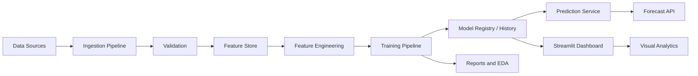

# Software Engineering Project Documentation Report

## Cover Page

**Project Name:** Pearls AQI Predictor  
**Author:** Shaheer Yar Khan  
**Internship Organization:** 10Pearls  
**Submission Date:** 07 June 2026  

---

# Pearls AQI Predictor

## 1. Executive Summary

Pearls AQI Predictor is an end-to-end air quality forecasting platform designed to ingest hourly weather and pollutant data, engineer predictive features, train and evaluate multiple machine learning models, and deliver short-term AQI forecasts through an API and interactive dashboard. The system supports local development through a SQLite-backed feature store while also exposing cloud-ready adapters for Vertex AI and Hopsworks. The solution includes model registration, model history tracking, explainability, reporting, and visual exploratory analysis.

The project is structured as a complete software engineering workflow: data ingestion, feature engineering, model training, model evaluation, model serving, dashboarding, and documentation. It demonstrates practical application of data engineering, machine learning operations, and web application development in a production-oriented architecture.

## 2. Introduction

### Background

Air pollution is a major environmental and public health challenge, and timely AQI forecasting helps individuals, organizations, and policy teams take preventive action. Predictive systems can support proactive decisions such as minimizing exposure during hazardous periods and planning city-level interventions.

### Objectives

The objectives of this project are to:

- ingest hourly air quality and weather observations
- transform raw data into reusable features
- train and compare several forecasting models
- register and manage trained models
- generate forecasts with hazard detection
- provide an API and dashboard for end users
- produce reports and analysis artifacts for evaluation

### Scope

The project covers the full lifecycle of an AQI prediction system:

- data acquisition
- validation and persistence
- feature generation
- model training and backtesting
- model history and champion selection
- explainability and EDA
- deployment-ready API and dashboard
- report generation and CI automation

The current workspace uses a local SQLite-backed development store by default, while the architecture is designed to extend to cloud-native storage and registry services.

## 3. Problem Statement

AQI data is often volatile, incomplete, and distributed across multiple sources. Without a structured forecasting pipeline, users cannot easily understand upcoming air quality conditions or assess the risk of hazardous exposure in advance.

This project solves the problem by creating a repeatable, automated AQI prediction system that:

- consolidates raw observations
- validates and stores the data safely
- generates actionable forecasts
- tracks model quality over time
- exposes results through a user-friendly dashboard and API

## 4. Requirement Analysis

### Functional Requirements

- The system shall ingest hourly AQI-related observations from configured sources.
- The system shall validate and store raw observations in a feature store backend.
- The system shall generate supervised learning features from historical data.
- The system shall train multiple candidate models and compare their performance.
- The system shall register the champion model and maintain model history.
- The system shall generate one-step and multi-hour AQI forecasts.
- The system shall provide API endpoints for health, metrics, model info, prediction, and forecast.
- The system shall provide a Streamlit dashboard for forecasts, historical trends, explainability, reports, and EDA.
- The system shall generate evaluation reports and visual artifacts.
- The system shall support optional cloud backends for production deployment.

### Non-Functional Requirements

- The system shall be modular and maintainable.
- The system shall support local development without cloud credentials.
- The system shall be extensible to cloud feature stores and managed deployment environments.
- The system shall validate data before processing.
- The system shall preserve model and feature versioning.
- The system shall provide acceptable response times for prediction endpoints.
- The system shall be testable through automated unit tests and CI workflows.
- The system shall handle missing optional dependencies gracefully.

## 5. System Architecture

### Architecture Overview

The architecture follows a layered pipeline pattern:

1. Data ingestion retrieves raw observations from synthetic or external providers.
2. Validation ensures the raw frame conforms to expected schema and quality rules.
3. Feature engineering produces lag, rolling, temporal, and cyclical features.
4. Training builds supervised datasets, evaluates multiple models, and selects a champion.
5. Storage persists raw data, features, predictions, and model metadata.
6. Serving loads the champion artifact and provides forecast endpoints.
7. Dashboarding visualizes trends, model performance, explainability, and reports.

### Architecture Diagram Description

The system can be visualized as the following logical flow:



### Component Interaction

- The ingestion layer creates and persists raw measurement records.
- The feature pipeline reads raw records and builds model-ready features.
- The training pipeline consumes raw and engineered data to produce trained artifacts.
- The feature store holds historical measurements, feature frames, and model metadata.
- The serving layer loads the latest champion model and generates forecasts on demand.
- The dashboard reads from the service and the store to present forecast, history, and reporting views.

## 6. Technology Stack

### Frontend

- **Streamlit**: used for the interactive dashboard because it enables rapid analytical UI development with charts, tables, and controls.
- **Plotly**: used for interactive visualizations, forecast plots, history charts, and performance summaries.

### Backend

- **FastAPI**: used for the model serving API because it provides typed request/response schemas and fast endpoint development.
- **Python**: used across the entire codebase for data engineering, machine learning, and service logic.

### Database

- **SQLite**: used as the default development store to keep the project runnable locally.
- **BigQuery**: supported through the Vertex feature store adapter for production-style storage.

### Other Tools / APIs

- **scikit-learn**: classical model training and evaluation.
- **TensorFlow**: LSTM and GRU sequence models.
- **XGBoost**: boosted tree regression support.
- **Matplotlib**: evaluation plots and residual charts.
- **Pandas / NumPy**: data transformation and numerical processing.
- **Requests**: external API integration.
- **Joblib**: model artifact serialization.
- **SHAP**: explainability when installed.
- **GitHub Actions**: automated CI and pipeline execution.
- **Google Cloud SDK libraries**: cloud feature store and deployment support.

### Justification for Each Technology

- **Streamlit** was selected for fast delivery of a rich, interactive analytics dashboard.
- **FastAPI** was selected because the API needs schema validation, high performance, and clear endpoint contracts.
- **SQLite** was selected for local portability and zero-setup development.
- **BigQuery / Vertex AI** were selected to support a cloud-based, scalable production design.
- **scikit-learn** supports reliable baseline and classical forecasting models.
- **TensorFlow** enables sequence-based forecasting experiments.
- **Plotly** improves dashboard usability through interactive visual exploration.
- **GitHub Actions** automates validation, pipeline execution, and artifact generation.

## 7. System Design

### Module Design

- `aqi_predictor.data_pipeline` handles source integrations and ingestion.
- `aqi_predictor.feature_pipeline` handles feature generation and materialization.
- `aqi_predictor.feature_store` abstracts persistence and model registry behavior.
- `aqi_predictor.training_pipeline` handles model selection, training, backtesting, and evaluation.
- `aqi_predictor.prediction_service` handles serving, authorization, and runtime forecasting.
- `aqi_predictor.dashboard` provides the analyst-facing user interface.
- `aqi_predictor.analysis` and `aqi_predictor.reporting` create EDA and final project outputs.

### Class Design

Key classes include:

- `CityProfile` for city configuration and geospatial metadata
- `AQIMeasurement` for raw observation records
- `ForecastPoint` for forecast outputs and hazard flags
- `ModelMetadata` for model registry details
- `LocalFeatureStore` for SQLite persistence
- `VertexFeatureStore` and `HopsworksFeatureStore` as cloud-ready adapters
- `ModelArtifact` for saving, loading, and predicting with trained models
- `AQIPredictionService` for orchestrating inference and forecast generation
- `MetricsRegistry` for service metrics tracking

### Database Design

The local store maintains the following primary tables:

- `raw_measurements`
- `features`
- `models`
- `predictions`
- `model_history`

### ERD Explanation

The design is centered on historical raw measurements. Each measurement row can be transformed into engineered features, which are then used to train models. Trained models are stored with metrics and metadata, while predictions are recorded for traceability.

Conceptually:

- one city can have many raw measurements
- one city can have many feature rows
- one trained model can have many prediction records
- model history preserves ranked versions and champion status over time

## 8. Implementation Details

### Frontend Implementation

The dashboard is implemented in Streamlit and organized into functional sections:

- overview and current conditions
- forecast explorer
- historical trends
- explainability
- operations monitoring
- model reports
- EDA visualizations
- setup and recovery guidance

The interface uses Plotly charts, metric cards, styled information panels, and downloadable data views.

### Backend Implementation

The backend is built using FastAPI and exposes endpoints for:

- service health
- service metrics
- model metadata
- one-step prediction
- multi-hour forecasting

The backend loads the champion artifact from the feature store registry and uses the recursive forecasting logic to produce future AQI points.

### API Design

Current API endpoints:

- `GET /health`
- `GET /metrics`
- `GET /model-info`
- `POST /predict`
- `POST /forecast`

Request validation is handled through Pydantic models, and responses are structured for predictable consumption by client applications.

### Authentication & Authorization

The API supports optional key-based access control using an `x-api-key` header. If an access token is configured, requests must present the correct token to access protected endpoints.

### Data Flow

1. Data is fetched or synthesized for a configured city.
2. The ingestion pipeline validates and stores raw records.
3. The feature pipeline materializes engineered training data.
4. The training pipeline splits data, trains models, and evaluates metrics.
5. The best model is registered as champion.
6. The serving layer loads the champion model for prediction.
7. The dashboard and reports present the outputs to the user.

## 9. Project Structure

### Folder Structure Explanation

- `aqi_predictor/` contains the application source code.
- `aqi_predictor/api/` contains the FastAPI entrypoint.
- `aqi_predictor/dashboard/` contains the Streamlit application.
- `aqi_predictor/data_pipeline/` contains ingestion and source adapters.
- `aqi_predictor/feature_pipeline/` contains feature logic.
- `aqi_predictor/feature_store/` contains local, Vertex, and Hopsworks adapters.
- `aqi_predictor/training_pipeline/` contains training, evaluation, and forecasting code.
- `aqi_predictor/monitoring/` contains metrics and explainability utilities.
- `aqi_predictor/analysis/` contains EDA generation.
- `aqi_predictor/reporting/` contains final report generation.
- `tests/` contains automated tests.
- `docs/` contains technical documentation and runbooks.
- `infrastructure/` contains deployment manifests.

### Key Files Description

- [`aqi_predictor/configs/settings.py`](../aqi_predictor/configs/settings.py) - application configuration and environment loading
- [`aqi_predictor/data_pipeline/ingest.py`](../aqi_predictor/data_pipeline/ingest.py) - ingestion and backfill workflow
- [`aqi_predictor/feature_pipeline/engine.py`](../aqi_predictor/feature_pipeline/engine.py) - feature engineering logic
- [`aqi_predictor/feature_store/local_store.py`](../aqi_predictor/feature_store/local_store.py) - SQLite-backed persistence and model registry
- [`aqi_predictor/training_pipeline/train.py`](../aqi_predictor/training_pipeline/train.py) - main training pipeline
- [`aqi_predictor/prediction_service/app.py`](../aqi_predictor/prediction_service/app.py) - API service entrypoint
- [`aqi_predictor/dashboard/app.py`](../aqi_predictor/dashboard/app.py) - dashboard application
- [`aqi_predictor/analysis/eda.py`](../aqi_predictor/analysis/eda.py) - EDA analysis and visualizations
- [`aqi_predictor/reporting/generate.py`](../aqi_predictor/reporting/generate.py) - final report generation
- [`.github/workflows/ci.yml`](../.github/workflows/ci.yml) - CI and pipeline automation

## 10. Features and Functionalities

### Detailed Feature Description

- **Hourly ingestion**: pulls or synthesizes AQI, pollutant, and weather records.
- **Data validation**: checks schema completeness, missing values, duplicates, and numeric ranges.
- **Feature engineering**: creates temporal, lagged, and rolling features.
- **Multi-model training**: evaluates baseline, linear, tree-based, and sequence models.
- **Model comparison**: ranks models using RMSE, MAE, R2, and MAPE.
- **Model history**: stores model metadata and performance for later review.
- **Champion selection**: registers the best model for serving.
- **Forecasting**: generates one-step and 72-hour forecasts with confidence bounds.
- **Hazard detection**: flags forecast hours that exceed hazard thresholds.
- **Explainability**: computes global and local feature importance, with SHAP when available.
- **EDA visualizations**: produces distributions, correlation patterns, target relationships, and time-series plots.
- **Reporting**: generates final evaluation and summary reports.
- **Operations monitoring**: exposes request counts, latency, and error metrics.

### User Workflow

1. Configure the environment and data source.
2. Run the feature pipeline if raw data is missing.
3. Run the training pipeline to produce the champion model.
4. Start the API service.
5. Open the dashboard to inspect forecasts and reports.
6. Review the model history, explainability outputs, and EDA sections.

## 11. Testing

### Test Strategy

The testing approach focuses on pipeline integrity, data source parsing, feature materialization, and metrics tracking. Tests are written with the standard library `unittest` framework for portability.

### Test Cases Table

| Test Case | Objective | Expected Result |
| --- | --- | --- |
| Backfill and materialize pipeline | Verify historical data ingestion and feature creation | Raw rows are saved and supervised features are produced |
| Incremental ingestion | Verify snapshot ingestion appends data | Raw measurements increase or remain consistent |
| AQICN payload parsing | Confirm external API response mapping | Observation fields are parsed correctly |
| Metrics registry | Verify request tracking | Metrics snapshot shows recorded requests |

### Results

The local unit test suite passes in the current workspace using `python -m unittest tests.test_pipeline`.

### Bug Fixes

The following issue was identified and corrected during review:

- a missing `compute_evaluation` import in the recursive backtest module
- a missing `scipy` dependency required by the EDA module

## 12. Security Considerations

### Input Validation

- API requests are validated using Pydantic schemas.
- Raw sensor frames are validated before persistence.
- Numeric range checks and duplicate detection help prevent malformed data from propagating.

### Authentication

- The API supports optional key-based authorization through an access token header.
- In production, secrets should be injected via environment variables or a secret manager.

### Data Protection

- SQL queries in the local store use parameterized statements.
- Model and forecast metadata are persisted for traceability.
- The system is designed to avoid hardcoding secrets in source code.

### Error Handling

- Exceptions are logged using a centralized logger.
- Service methods wrap failures and return controlled runtime errors.
- The dashboard includes fallback states when data or models are unavailable.

## 13. Performance Considerations

### Optimization Techniques

- pandas and NumPy are used for vectorized feature engineering.
- model artifacts are serialized for fast loading
- local data access is optimized with database indexes
- lightweight API endpoints keep serving latency low

### Scalability Discussion

The project is designed to scale from local development to cloud deployment by swapping the feature store backend and model storage path. Vertex AI and BigQuery support larger datasets and production workloads, while Cloud Run can scale the API and dashboard independently.

## 14. Deployment and Configuration

### Environment Setup

The project loads configuration from environment variables and optional `.env` files. A local installation can run without cloud credentials, while production can target cloud-based services.

### Installation Steps

```bash
python -m pip install -r requirements.txt
```

### Deployment Process

Typical deployment order:

1. Set environment variables for the chosen backend.
2. Run the feature pipeline to seed raw data.
3. Run the training pipeline to generate a champion model.
4. Launch the API service.
5. Launch the dashboard.
6. Use GitHub Actions for automated validation and artifact generation.

Deployment references:

- [Dockerfile.api](../Dockerfile.api)
- [Dockerfile.dashboard](../Dockerfile.dashboard)
- [infrastructure/cloudrun-api.yaml](../infrastructure/cloudrun-api.yaml)
- [infrastructure/cloudrun-dashboard.yaml](../infrastructure/cloudrun-dashboard.yaml)

## 15. Challenges Faced and Solutions

- **Challenge:** Managing different data source providers with different payload formats.  
  **Solution:** Introduced source adapters and a common measurement model.

- **Challenge:** Supporting both local and cloud persistence.  
  **Solution:** Created a feature store abstraction with local, Vertex, and Hopsworks adapters.

- **Challenge:** Building forecasts recursively over a multi-hour horizon.  
  **Solution:** Added recursive context generation and forecast point construction.

- **Challenge:** Maintaining model traceability.  
  **Solution:** Added metadata registration, history tracking, and champion management.

- **Challenge:** Providing explainability across model families.  
  **Solution:** Implemented SHAP-based logic when available, with transparent fallbacks otherwise.

## 16. Lessons Learned

- Modular design is essential for ML systems that combine data engineering, training, and serving.
- Feature and model versioning improve reproducibility and operational confidence.
- A single project can require both software engineering rigor and data science validation.
- Automated reporting and CI reduce manual checking and make project evaluation easier.
- Cloud-ready abstractions are valuable even when the development environment is local.

## 17. Future Enhancements

- Move the default feature store to a fully managed cloud backend.
- Add stronger overfitting controls such as cross-validation and train/validation gap reporting.
- Expand the model registry with richer promotion and rollback workflows.
- Add stronger monitoring and alerting for forecast drift and data quality shifts.
- Improve test coverage for dashboard and serving paths.
- Add scheduled workflow orchestration for hourly ingestion and daily training in production.

## 18. Project Outcomes

The project delivers the following tangible outcomes:

- an operational AQI forecasting pipeline
- a modular codebase that separates ingestion, training, serving, and reporting concerns
- a model registry and model history mechanism
- a dashboard for operational and analytical visibility
- a reproducible test and CI workflow
- cloud-ready adapters for production migration

## 19. Conclusion

Pearls AQI Predictor demonstrates a complete software engineering solution for AQI forecasting. The project integrates data ingestion, feature engineering, model training, model history, explainability, reporting, and service deployment into a single maintainable repository. It is suitable for portfolio review, project submission, and technical evaluation because it shows both system design and practical implementation of an end-to-end ML application.

## 20. References

- Project source code in this repository
- [docs/architecture.md](../docs/architecture.md)
- [docs/runbook.md](../docs/runbook.md)
- [docs/production_setup.md](../docs/production_setup.md)
- [docs/vertex_deployment_checklist.md](../docs/vertex_deployment_checklist.md)
- [aqi_predictor/analysis/eda.py](../aqi_predictor/analysis/eda.py)
- [aqi_predictor/training_pipeline/train.py](../aqi_predictor/training_pipeline/train.py)
- [aqi_predictor/prediction_service/app.py](../aqi_predictor/prediction_service/app.py)
- [aqi_predictor/dashboard/app.py](../aqi_predictor/dashboard/app.py)
